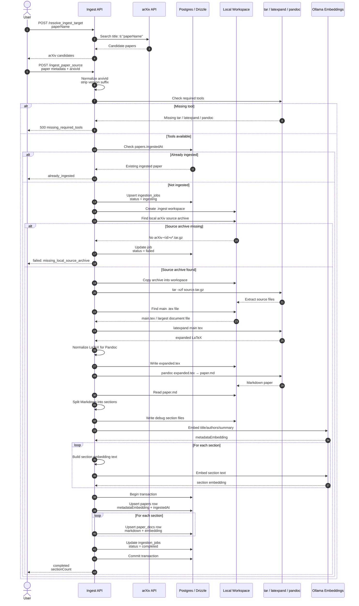
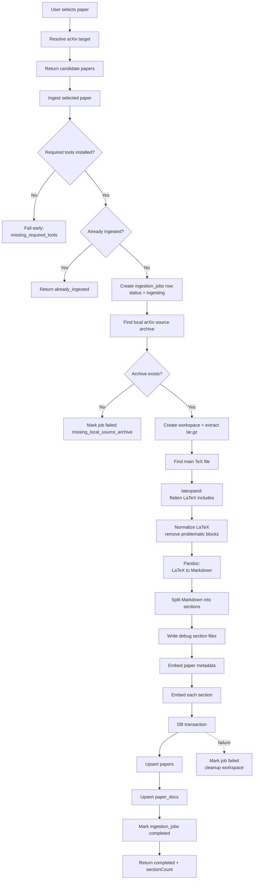

```mermaid
sequenceDiagram
    autonumber

    actor User
    participant API as Ingest API
    participant Arxiv as arXiv API
    participant DB as Postgres / Drizzle
    participant FS as Local Workspace
    participant Tools as tar / latexpand / pandoc
    participant Embed as Ollama Embeddings

    User->>API: POST /resolve_ingest_target<br/>paperName
    API->>Arxiv: Search title: ti:"paperName"
    Arxiv-->>API: Candidate papers
    API-->>User: arXiv candidates

    User->>API: POST /ingest_paper_source<br/>paper metadata + arxivId

    API->>API: Normalize arxivId<br/>strip version suffix

    API->>Tools: Check required tools
    alt Missing tool
        Tools-->>API: Missing tar / latexpand / pandoc
        API-->>User: 500 missing_required_tools
    else Tools available
        API->>DB: Check papers.ingestedAt
        alt Already ingested
            DB-->>API: Existing ingested paper
            API-->>User: already_ingested
        else Not ingested
            API->>DB: Upsert ingestion_jobs<br/>status = ingesting

            API->>FS: Create .ingest workspace
            API->>FS: Find local arXiv source archive

            alt Source archive missing
                FS-->>API: No arXiv-<id>v*.tar.gz
                API->>DB: Update job<br/>status = failed
                API-->>User: failed: missing_local_source_archive
            else Source archive found
                API->>FS: Copy archive into workspace
                API->>Tools: tar -xzf source.tar.gz
                Tools-->>FS: Extract source files

                API->>FS: Find main .tex file
                FS-->>API: main.tex / largest document file

                API->>Tools: latexpand main tex
                Tools-->>API: expanded LaTeX

                API->>API: Normalize LaTeX for Pandoc
                API->>FS: Write expanded.tex

                API->>Tools: pandoc expanded.tex → paper.md
                Tools-->>FS: Markdown paper

                API->>FS: Read paper.md
                API->>API: Split Markdown into sections
                API->>FS: Write debug section files

                API->>Embed: Embed title/authors/summary
                Embed-->>API: metadataEmbedding

                loop For each section
                    API->>API: Build section embedding text
                    API->>Embed: Embed section text
                    Embed-->>API: section embedding
                end

                API->>DB: Begin transaction
                API->>DB: Upsert papers row<br/>metadataEmbedding + ingestedAt

                loop For each section
                    API->>DB: Upsert paper_docs row<br/>markdown + embedding
                end

                API->>DB: Update ingestion_jobs<br/>status = completed
                API->>DB: Commit transaction

                API-->>User: completed<br/>sectionCount
            end
        end
    end
```

```mermaid
flowchart TD
    A[User selects paper] --> B[Resolve arXiv target]
    B --> C[Return candidate papers]
    C --> D[Ingest selected paper]

    D --> E{Required tools installed?}
    E -- No --> F[Fail early:<br/>missing_required_tools]
    E -- Yes --> G{Already ingested?}

    G -- Yes --> H[Return already_ingested]
    G -- No --> I[Create ingestion_jobs row:<br/>status = ingesting]

    I --> J[Find local arXiv source archive]
    J --> K{Archive exists?}
    K -- No --> L[Mark job failed:<br/>missing_local_source_archive]
    K -- Yes --> M[Create workspace + extract tar.gz]

    M --> N[Find main TeX file]
    N --> O[latexpand:<br/>flatten LaTeX includes]
    O --> P[Normalize LaTeX<br/>remove problematic blocks]
    P --> Q[Pandoc:<br/>LaTeX to Markdown]
    Q --> R[Split Markdown into sections]
    R --> S[Write debug section files]

    S --> T[Embed paper metadata]
    T --> U[Embed each section]

    U --> V[DB transaction]
    V --> W[Upsert papers]
    W --> X[Upsert paper_docs]
    X --> Y[Mark ingestion_jobs completed]
    Y --> Z[Return completed + sectionCount]

    V -. failure .-> AA[Mark job failed<br/>cleanup workspace]
```
