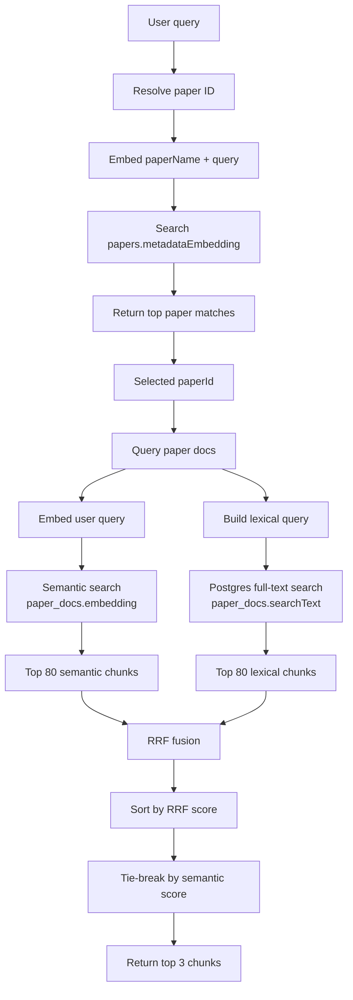

## Retrieval architecture

This is a **two-stage hybrid retrieval architecture** for paper RAG:

```txt
User query
   │
   ▼
1. Resolve paper namespace
   │
   ▼
2. Search chunks inside that paper
   │
   ├── semantic vector search
   └── lexical full-text search
        │
        ▼
3. Fuse results with RRF
        │
        ▼
Top 3 Markdown chunks returned as RAG context
```

The uploaded retrieval route defines two main endpoints: `/resolve_paper_id` and `/query_paper_docs`, with limits of 3 paper matches, 80 semantic candidates, 80 lexical candidates, and 3 final returned chunks.

---

## 1. Paper resolution stage

Endpoint:

```ts
POST / api / retrieval / resolve_paper_id;
```

Input:

```ts
{
  (paperName, query);
}
```

The system combines the paper name and user query:

```ts
const searchText = `${body.paperName}\n${body.query}`;
```

Then it embeds that combined text and compares it against:

```ts
papers.metadataEmbedding;
```

using cosine distance:

```ts
const distance = cosineDistance(papers.metadataEmbedding, queryEmbedding);
const confidence = sql<number>`1 - (${distance})`;
```

So this stage answers:

> “Which paper is the user probably asking about?”

It returns the top 3 likely papers, including title, paper ID, arXiv ID, confidence, authors, summary, and source URL.

### Why this stage exists

This avoids searching every chunk from every paper globally. Instead, retrieval first resolves a **paper namespace**, then searches sections only inside that paper.

That gives you this structure:

```txt
papers
  └── paper_docs
        └── chunks for one resolved paper
```

This is a strong design for academic-paper retrieval because many papers may share terms like “attention,” “alignment,” “diffusion,” “benchmark,” or “transformer.” Resolving the paper first reduces cross-paper noise.

---

## 2. Chunk retrieval stage

Endpoint:

```ts
POST / api / retrieval / query_paper_docs;
```

Input:

```ts
{
  (paperId, query, lexicalQuery);
}
```

This searches only inside one paper:

```ts
where paperDocs.paperId = body.paperId
```

It runs two searches in parallel:

```txt
semantic search + lexical search
```

---

## 3. Semantic retrieval path

The semantic path embeds the user query:

```ts
const queryEmbedding = await embed(body.query);
```

Then compares it against section embeddings:

```ts
paperDocs.embedding;
```

using cosine distance:

```ts
const semanticDistance = cosineDistance(paperDocs.embedding, queryEmbedding);
const semanticScore = sql<number>`1 - (${semanticDistance})`;
```

Rows are ordered by nearest vector distance:

```ts
.orderBy(asc(semanticDistance))
.limit(semanticCandidateLimit)
```

So the semantic retriever finds sections that are conceptually similar to the query, even if they do not share exact wording.

Example:

```txt
Query: "How do they train the reward model?"
```

could retrieve a section titled:

```txt
Preference Optimization
```

even if the exact phrase “reward model” appears only lightly or indirectly.

---

## 4. Lexical retrieval path

The lexical path uses Postgres full-text search:

```ts
websearch_to_tsquery("simple", lexicalQuery);
```

and ranks matches using:

```ts
ts_rank_cd(...)
```

The query condition is:

```ts
paperDocs.searchText @@ websearch_to_tsquery('simple', lexicalQuery)
```

This is the exact-term / keyword channel.

It is especially useful for:

- acronyms
- method names
- benchmark names
- equations or symbols represented as text
- dataset names
- citation terms
- rare technical phrases

Example:

```txt
lexicalQuery: "DPO OR PPO"
```

can force retrieval toward chunks containing those exact technical terms.

---

## 5. Fusion layer: Reciprocal Rank Fusion

The helper code implements **RRF**, or **Reciprocal Rank Fusion**.

Constant:

```ts
const rrfK = 60;
```

Each candidate gets:

```ts
1 / (rrfK + rank);
```

So a rank-1 hit contributes:

```txt
1 / (60 + 1) = 0.0164
```

A rank-80 hit contributes:

```txt
1 / (60 + 80) = 0.0071
```

If the same chunk appears in both semantic and lexical results, it gets both contributions:

```txt
final RRF score =
  semantic rank contribution
  + lexical rank contribution
```

That means the best chunks are usually ones that are:

```txt
semantically relevant
AND/OR
lexically exact
```

But chunks appearing in both channels get a natural boost.

---

## 6. Final ranking

After semantic and lexical candidates are merged into a `Map` by `chunkId`, the system sorts by:

```ts
rrfScore desc
```

Then breaks ties using:

```ts
semanticScore desc
```

Finally it returns:

```ts
finalChunkLimit = 3;
```

So the final output is the top 3 fused chunks.

Each chunk includes:

```ts
{
  (chunkId, section, text, rrfScore, semanticScore, lexicalScore);
}
```

Returned as Markdown:

```md
Relevant documentation for /arxiv/...
Query: ...
Lexical query: ...

## Section name

Chunk ID: ...
RRF score: ...
Semantic score: ...
Lexical score: ...

<chunk markdown>
```

---

## Architecture diagram



---

## What kind of retrieval system this is

This is best described as:

> A **namespace-first hybrid RAG retriever** using paper-level vector resolution, section-level semantic search, section-level lexical search, and Reciprocal Rank Fusion to return the top Markdown chunks as context.

Or more compactly:

```txt
paper-level semantic routing
        +
section-level hybrid retrieval
        +
RRF reranking
```

---

## Strengths

### Good separation of concerns

The system does not search chunks immediately. It first resolves the paper, then searches inside the paper. That is clean and usually better for multi-paper corpora.

### Hybrid search is the right call

Semantic search catches conceptual matches. Lexical search catches exact technical terms. For research papers, you usually need both.

### RRF is a sensible fusion strategy

RRF avoids trying to directly compare incompatible score scales:

```txt
cosine similarity score ≠ ts_rank_cd score
```

Instead, it fuses by rank, which is more robust.

### Markdown output is agent-friendly

The endpoint returns Markdown with section names, chunk IDs, and scores, which makes it usable as direct RAG context.

---

## Weak spots

### No score threshold

The system always returns the top 3 chunks if anything exists. That can return weak context when the query is unrelated to the paper.

A useful addition would be a minimum threshold, for example:

```txt
return no result if:
  semanticScore < X
  and lexicalScore is missing
```

### Lexical quality depends on caller-supplied `lexicalQuery`

The API separates:

```ts
query;
lexicalQuery;
```

That gives flexibility, but it means another layer must generate a good lexical query. If `lexicalQuery` is poor or empty, the system becomes semantic-only.

### RRF ignores score magnitude

A semantic rank-1 result with score `0.90` and another with score `0.61` both get the same rank contribution if they appear at the same rank position in their respective lists. RRF is robust, but it hides confidence strength.

### No reranker

The final top 3 are selected by RRF, not by a cross-encoder or LLM reranker. For many cases that is fine, but for hard scientific questions, a reranking layer could improve precision.

---

## Best one-line description

This retrieval architecture uses **paper-level vector routing followed by section-level hybrid search, where semantic and lexical candidates are merged with Reciprocal Rank Fusion and returned as the top 3 Markdown chunks for RAG context.**
